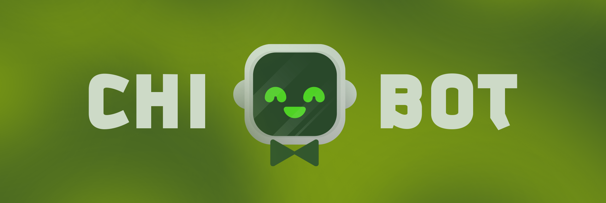

## 

A lightweight, self-hosted Discord bot built to run beautifully on a Raspberry Pi — multi-server, RAM-optimized, and packed with music, soundboards, custom triggers, and admin tooling.

> [!NOTE]
> **Chibot is a work in progress.** The core (voice, replay, admin, auth, fun commands) is up and running, but several features are still being built. See the [Roadmap](#construction-roadmap) for what's live and what's coming.

<br>

## :sparkles: Highlights

- **Runs anywhere** — Windows, macOS and Linux, designed around the constraints of a Raspberry Pi.
- **RAM optimized** — voice buffers are trimmed continuously and freed the moment the bot leaves a channel.
- **Multi-guild** — every server keeps its own isolated settings, assets and state.
- **Localized** — all user-facing text lives in `locale.json`, ready to be translated.
- **Highly customizable** — per-guild themes, authenticators and (soon) triggers and commands.

<br>

## :jigsaw: Features

### Voice & Audio

- **Rolling replay buffer** — Chibot continuously records the voice channel it's in, keeping the last **120 seconds** in memory. Use `/replay` to instantly clip the last few seconds of chaos.
- **Per-user mixing** — each speaker is buffered separately, silence-padded and overlaid, so replays stay perfectly in sync.
- **Pitch effects** — bend any replay from `0.0` (slow and deep) to `2.0` (fast and squeaky).
- **Audio playback** — stream from YouTube or any direct URL via `yt-dlp` + `ffmpeg`.
- **Downloads** — pull any supported video down as an `.mp3` with `/download`.
- **Smart auto-disconnect** — leaves on its own after being alone for 15 seconds, clearing its buffers.

### Messaging & Moderation

- **Message builder** — `/say` opens an interactive builder with embeds, attachments and a 15-minute editing session.
- **Anonymous messages** — `/anon` sends a message to a channel or straight to a user's DMs.
- **Protective purge** — `/purge` skips pinned messages and anything marked with :star:, and stops at the :triangular_flag_on_post: bookmark.

### Guild Themes

- **Calendar-driven server icons** — schedule icons by date and Chibot rotates the server avatar automatically.
- **Sleep icons** — pair an icon with a "sleeping" variant and wake/sleep hours, and the server avatar changes with the time of day.

### Authenticators

- **TOTP vault** — `/auth` stores 2FA authenticators per guild (or privately per user in DMs) and generates codes on demand, with a live expiration countdown.
- **Permission-gated** — only administrators can add or remove entries; everyone else can only read codes.

### Fun

- `/flip`, `/roll` and `/roulette` — interactive, re-rollable button views.

<br>

## :busts_in_silhouette: Commands

| Command | Scope | Description |
| :--- | :--- | :--- |
| `/replay` | Guild | Generate an audio replay from the connected voice channel |
| `/play` | Guild | Play audio from a search term or URL |
| `/download` | Guild | Download videos as `.mp3` files |
| `/say` | Guild | Build and send a message *(Manage Server)* |
| `/attach` | Guild | Attach files or images to a message or builder *(Manage Server)* |
| `/purge` | Guild | Purge messages, preserving pinned and starred ones *(Manage Messages)* |
| `/addicon` | Guild | Schedule a themed server icon *(Administrator)* |
| `/auth` | Anywhere | List and generate authenticator codes |
| `/anon` | Anywhere | Send an anonymous message |
| `/avatar` | Guild | Fetch a user's avatar |
| `/clear` | DM | Clear all received direct messages |
| `/status` | Anywhere | Show current bot status |
| `/flip` | Anywhere | Flip a coin |
| `/roll` | Anywhere | Roll a die |
| `/roulette` | Anywhere | Play a round of russian roulette |

Bot owners can also sync the command tree from any message:

```
!sync here          # Sync commands to the current guild
!sync here force    # Wipe and re-register the current guild's commands
!sync here clear    # Remove all commands from the current guild
!sync all           # Sync commands globally
```

<br>

## :hammer_and_wrench: Preparations

1. Install **[uv](https://docs.astral.sh/uv/)**, the Python project manager Chibot uses:

   ```bash
   # Windows
   winget install astral-sh.uv

   # macOS / Linux
   curl -LsSf https://astral.sh/uv/install.sh | sh
   ```

   > uv handles the virtual environment and dependencies for you, and will download **Python 3.12+** automatically if your system doesn't have it — so there's nothing else to install.

2. Create a Discord application on the [Discord Developer Portal](https://discord.com/developers/applications) and **save the bot token**.
3. Under **Bot → Privileged Gateway Intents**, enable **Message Content**, **Server Members** and **Presence**.
4. Invite the bot to your server with administrator privileges.
   > Give it the highest role in the server to unlock every feature — server icon rotation requires it.

<br>

## :package: Installation

Chibot runs on **Windows**, **macOS** and **Linux**. Clone the repository, then:

```bash
uv sync
```

That's the whole setup. `uv sync` creates a virtual environment in `.venv/`, downloads a compatible Python if you don't have one, and installs every dependency at the exact version recorded in `uv.lock` — **including ffmpeg**, which ships inside the `imageio-ffmpeg` wheel. There is no separate `apt-get` / `brew` / `choco` step.

> [!TIP]
> You never need to activate the virtual environment. Every `uv run` command below uses `.venv/` automatically.

**One exception — libopus on Linux and macOS.** discord.py bundles libopus for Windows, but on other platforms it loads the system copy, and it's the only piece Chibot can't ship for you. It's usually already present; if voice commands fail, install it:

```bash
sudo apt install libopus0    # Debian / Ubuntu / Raspberry Pi OS
brew install opus            # macOS
```

Chibot checks for it at startup and tells you the exact command if it's missing.

<br>

## :rocket: Initialization

From the project folder, start the bot with:

```bash
uv run chibot
```

`uv run` re-checks `uv.lock` before every launch and installs anything missing, so this is the only command you need — even on a fresh clone, `uv sync` is optional. There's also a launcher per platform, which does the same thing but works from *any* directory:

```powershell
.\start.ps1     # Windows
```

```bash
./start.sh      # macOS / Linux  (chmod +x start.sh once)
```

<details>
<summary>Other ways to start it</summary>

```bash
uv run python -m scripts     # equivalent; the module entry point
```

Both `chibot` and `python -m scripts` call `main()` in `scripts/runtime.py`, which moves the process to the project root before starting. Chibot reads `token.secret`, `settings.json`, `locale.json` and `guilds/` relative to the working directory, so this is what lets it launch from anywhere.

</details>

On the first run Chibot will ask for your Discord bot **token** and store it in `token.secret`. If you paste the wrong one, just open `token.secret` in any text editor, replace its contents, and run the command again.

Once the bot is online, send `!sync here` in your server to register the slash commands.

> [!IMPORTANT]
> `token.secret`, `settings.json` and `guilds/` are gitignored — they hold your bot token, TOTP secrets and per-guild assets. Never commit them.

<br>

## :wrench: Managing Dependencies

Dependencies are declared in `pyproject.toml` and locked to exact versions in `uv.lock`, and the Python version is pinned in `.python-version`. All three are committed, so every machine that runs `uv sync` gets an identical environment — uv downloads the pinned Python if the system doesn't have it. Change it with `uv python pin 3.13`.

| Command | What it does |
| :--- | :--- |
| `uv run chibot` | Start the bot |
| `.\start.ps1` / `./start.sh` | Start the bot from any directory |
| `uv sync` | Install/update the environment to match `uv.lock` |
| `uv add <package>` | Add a dependency and update the lockfile |
| `uv remove <package>` | Remove a dependency |
| `uv lock --upgrade` | Bump every dependency to the newest allowed version |
| `uv run python` | Open a REPL with the project's dependencies loaded |

If you'd rather use plain `pip`, `requirements.txt` is still there and is generated from the lockfile. Regenerate it after changing dependencies:

```bash
uv export --no-hashes --no-dev --no-emit-project --format requirements-txt -o requirements.txt
```

### Bundled binaries

Two dependencies exist to keep the install to a single command:

- **`imageio-ffmpeg`** ships an ffmpeg binary in its wheel, for every platform Chibot targets including 64-bit Raspberry Pi OS. `scripts/runtime.py` prefers a system ffmpeg when one is on `PATH` — that build is more complete and includes ffprobe — and falls back to the bundled copy otherwise. The resolved path is handed explicitly to discord.py, yt-dlp and pydub.
- **`audioop-lts`** replaces the `audioop` module, which pydub imports but which was removed from the standard library in Python 3.13. It installs only on 3.13+, so Chibot runs on both 3.12 and current releases.

<br>

## :file_folder: Project Structure

```
scripts/
├── runtime.py       # Startup — working dir, ffmpeg/opus, token prompt
├── __main__.py      # "python -m scripts" entry point
├── chibot.py        # Bot instance, intents and startup
├── events.py        # Gateway events, command sync, auto-disconnect
├── settings.py      # Config, localization, per-guild storage, icon rotation
├── voice.py         # Voice connection, replay buffers, playback, downloads
├── elements.py      # Reusable views, modals and buttons
└── cogs/
    ├── admin.py     # /say, /attach, /purge, /addicon
    ├── auth.py      # /auth — TOTP authenticator vault
    ├── common.py    # /status, /clear, /avatar, /anon, /replay, fun commands
    ├── musics.py    # /play, /download and music controls
    └── triggers.py  # Custom trigger messages (in progress)

start.ps1            # Launcher (Windows)
start.sh             # Launcher (macOS / Linux)
pyproject.toml       # Project metadata, dependencies and the "chibot" command
uv.lock              # Exact resolved dependency versions
.python-version      # Pinned Python version
locale.json          # All user-facing strings
settings.json        # Per-guild settings (gitignored)
guilds/              # Per-guild assets, e.g. icons (gitignored)
```

<br>

## :construction: Roadmap

**Working**

- [x] Voice replay buffer with pitch effects
- [x] Audio playback and `.mp3` downloads
- [x] Message builder, anonymous messages and protective purge
- [x] Scheduled server icon themes with sleep variants
- [x] TOTP authenticator vault
- [x] Fun commands and interactive views
- [x] Localization system

**In progress**

- [ ] Full music queue — `/skip`, `/pause`, `/stop` and shuffle
- [ ] Persistent music message with playback controls
- [ ] Custom trigger messages & responses
- [ ] Custom soundboard
- [ ] `/reminder`
- [ ] Dynamic per-guild custom commands

**Planned**

- [ ] Spotify playlist support
- [ ] `/theme` command to replace `/addicon`
- [ ] Additional locales
- [ ] AI-assisted responses

<br>

## :warning: A Note on Voice Recording

Chibot's replay feature keeps a rolling in-memory buffer of the voice channel it is connected to. Nothing is written to disk and the buffer is discarded the moment the bot disconnects — but anyone in the channel can clip the last two minutes. **Let your members know the bot records**, and check the laws that apply to you before deploying it.

<br>

#### NOW you are all set. Hope you enjoy!
